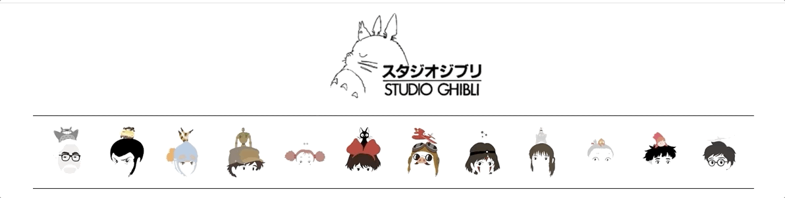

# Studio Ghibli GIPHY-API

[View Ghibli Giphy](https://aliciac1.github.io/Ghibli-API/)

### Concept: 
> View a library of Studio Ghibli themed gifs through a Studio Ghibli inspired interactive website.
> - Top Icons display fun facts regarding Studio Ghibli's co-founder, Hayao Miyazaki's contributions to Studio Ghibli films. Click on the toggle icons to view facts for each film.  
        
  > - Select a film to display gifs from Studio Ghibli films. 
  > - You can add additional Studio Ghibli films that are not already listed by inputing a new  film title and clicking "Add Another Film".
  > - Activiate gif animations by clicking on gifs. 
  > - Gif rating will be displayed at bottom of the page when hovering over the gif. 
        

### Built With : 
> - HTML 
> - CSS 
> - jQuery
> - [Giphy API](https://developers.giphy.com/)
> - BootStrap 

### Future Enhancements: 
> - Enable user to select gifs to download and save to their local computer. 
> - Select gifs to save to user's favorites, which can be accessed through the favorites toggle button. 

***Take no credit for Studio Ghibli artwork , icons, images. Pulled from other resources***

© aliciaC1
